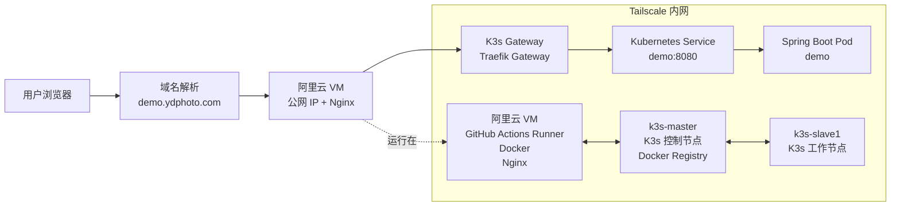
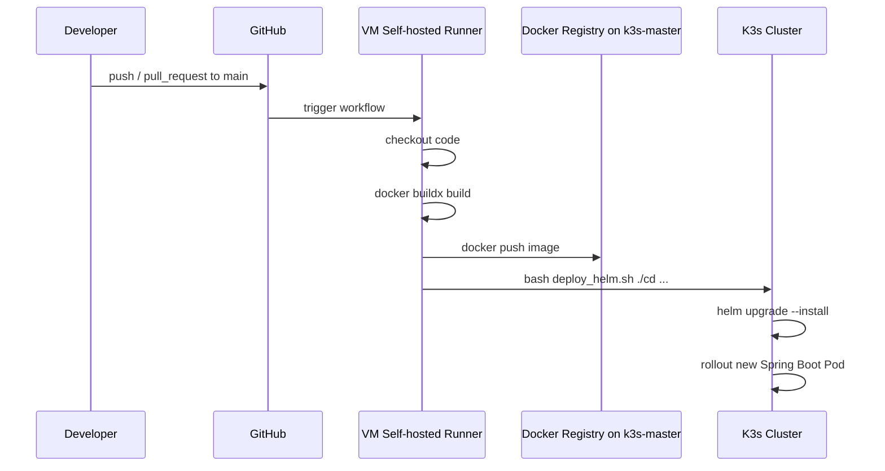

# demo

这是一个用于验证 GitHub Actions CI/CD 流程的 Spring Boot Demo 项目。项目会被构建成 Docker 镜像，推送到内网 Docker Registry，并通过 Helm 部署到本地 K3s 集群中。

线上访问地址：[https://demo.ydphoto.com/](https://demo.ydphoto.com/)

## 项目说明

当前项目主要用于测试从代码提交到容器构建、镜像推送、Helm 部署和公网访问的完整链路。

技术栈：

- Java 8
- Spring Boot 2.3.12
- Maven
- Docker
- GitHub Actions self-hosted runner
- Docker Registry
- K3s
- Helm
- Kubernetes Gateway API
- Nginx
- Tailscale

## 架构图



## 访问链路

公网访问链路如下：

```text
用户
  -> demo.ydphoto.com
  -> 阿里云 VM 公网 IP
  -> VM 上的 Nginx
  -> Tailscale 内网
  -> K3s Gateway
  -> Kubernetes Service
  -> Spring Boot Pod
```

说明：

- 域名 `demo.ydphoto.com` 解析到阿里云 VM 的公网 IP。
- VM 上运行 Nginx，负责接收公网流量并转发到 K3s Gateway。
- VM、`k3s-master`、`k3s-slave1` 通过 Tailscale 打通，三台机器处于同一个虚拟局域网。
- Spring Boot 应用实际运行在 K3s 集群中。
- K3s 使用 Gateway API 暴露应用入口，相关 YAML 位于 `cd/templates/httproute.yaml`。

## CI/CD 流程

GitHub Actions 配置位于 `.github/workflows/docker-image.yml`。

触发条件：

- 推送到 `main` 分支
- 向 `main` 分支发起 Pull Request

执行环境：

- 使用 `self-hosted` runner
- 该 runner 部署在阿里云 VM 上
- VM 上安装了 Docker，可直接执行镜像构建和推送

流程如下：



核心步骤：

1. GitHub Actions 在 VM 的 self-hosted runner 上拉取代码。
2. 使用 Docker 构建 `linux/amd64` 镜像。
3. 镜像 tag 使用当前提交 SHA：`${{ github.sha }}`。
4. 镜像推送到 `${{ vars.REGISTRY_URL }}/${REPO_NAME}:${TAG}`。
5. 执行 `deploy_helm.sh`，通过 Helm 部署到 K3s。
6. Helm values 中的 `HOSTNAME`、`API-NAME`、`TAG`、`ENVIRONMENT` 会在部署时被替换。

当前 workflow 的部署命令：

```bash
bash deploy_helm.sh ./cd ${REPO_NAME}.ydphoto.com ${REPO_NAME} ${TAG} dev
```

对于本仓库，`REPO_NAME=demo`，因此部署域名为：

```text
demo.ydphoto.com
```

## Helm 部署结构

Helm Chart 位于 `cd/` 目录。

主要文件：

- `cd/Chart.yaml`：Chart 元信息
- `cd/values.yaml`：默认部署参数
- `cd/templates/deployment.yaml`：Kubernetes Deployment
- `cd/templates/service.yaml`：Kubernetes Service
- `cd/templates/httproute.yaml`：Gateway API HTTPRoute
- `cd/templates/configmap.yaml`：应用配置
- `cd/templates/hpa.yaml`：HPA 配置

默认配置中：

- 服务端口：`8080`
- 健康检查：`/actuator/health`
- Prometheus 指标：`/actuator/prometheus`
- 镜像仓库：通过 `values.yaml` 中的 `image.repository` 控制
- 镜像版本：通过 `image.tag` 控制

## 本地运行

本地启动：

```bash
mvn spring-boot:run
```

本地测试：

```bash
mvn test
```

打包：

```bash
mvn clean package
```

构建 Docker 镜像：

```bash
docker build -t demo:local .
```

运行 Docker 容器：

```bash
docker run --rm -p 8080:8080 demo:local
```

## 接口

应用启动后可访问：

- `/`：静态首页
- `/hello?name=world`：测试接口
- `/user`：测试 JSON 返回
- `/actuator/health`：健康检查
- `/actuator/prometheus`：Prometheus 指标
- `/swagger-ui.html`：Swagger UI

## 部署脚本

`deploy_helm.sh` 用于生成临时 Helm values 文件，并执行部署。

用法：

```bash
bash deploy_helm.sh <chart_path> <hostname> <api_name> <tag> <environment>
```

示例：

```bash
bash deploy_helm.sh ./cd demo.ydphoto.com demo <git-sha> dev
```

脚本会将 `cd/values.yaml` 中的占位符替换为实际值：

- `HOSTNAME`
- `API-NAME`
- `TAG`
- `ENVIRONMENT`

然后执行：

```bash
helm upgrade --install <api_name> <chart_path> -f <temporary-values-file> \
  --rollback-on-failure \
  --wait \
  --timeout 180s
```

## 目录结构

```text
.
├── .github/workflows/docker-image.yml   # GitHub Actions CI/CD workflow
├── cd/                                  # Helm Chart
├── src/main/java/com/example/demo       # Spring Boot 源码
├── src/main/resources                   # 应用配置与静态资源
├── Dockerfile                           # Docker 多阶段构建
├── deploy_helm.sh                       # Helm 部署脚本
├── pom.xml                              # Maven 配置
└── README.md
```

## 备注

这个项目的重点不是业务功能，而是验证完整的 CI/CD 部署闭环：

```text
GitHub main 分支
  -> GitHub Actions
  -> VM self-hosted runner
  -> Docker build
  -> k3s-master Docker Registry
  -> Helm deploy
  -> K3s Gateway
  -> demo.ydphoto.com
```
